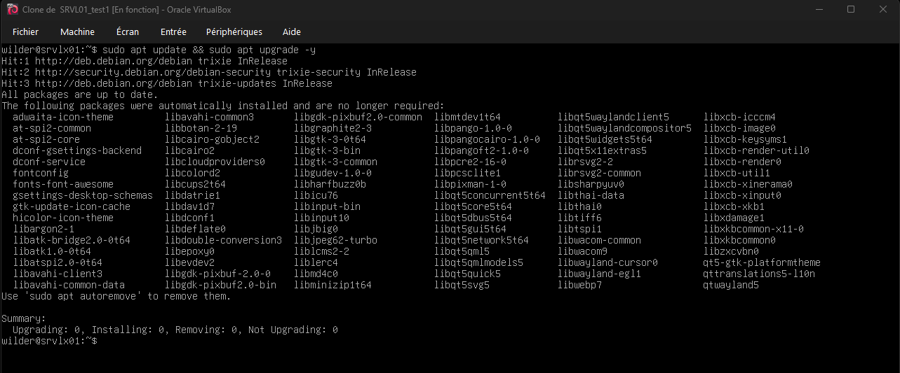
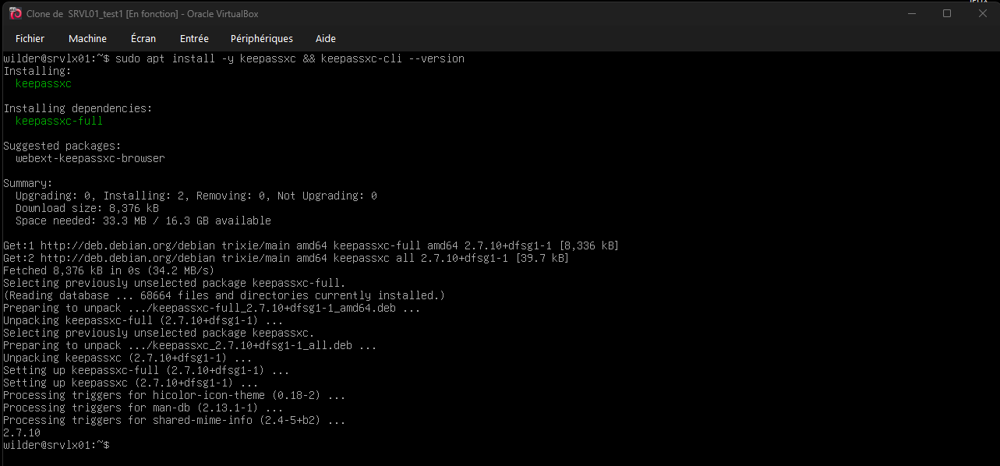
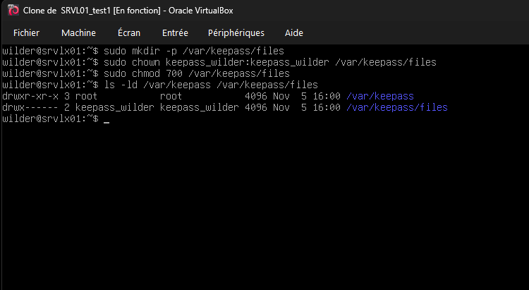
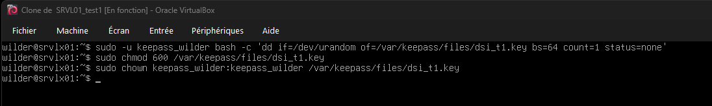
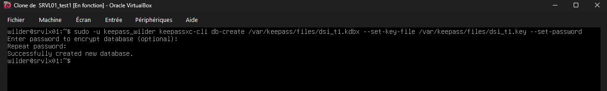
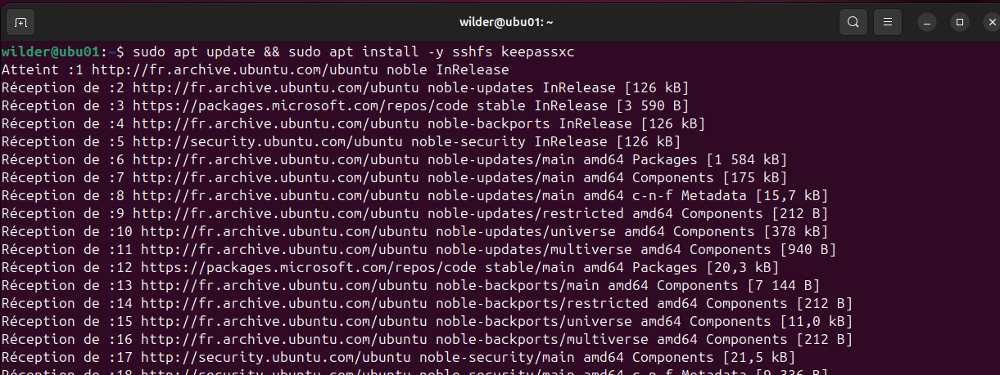
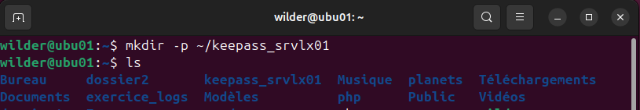
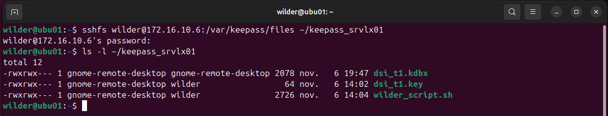
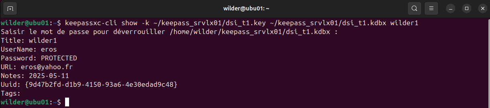

## Sommaire

1. [Prérequis technique](#prerequis-technique)
2. [Installation sur le serveur](#installation-sur-le-serveur)
3. [Installation sur le client](#installation-sur-le-client)
4. [FAQ](#faq)

# 1. Prérequis techniques

**Étapes 1 :**

  On va créer  quatre machines virtuelles :

  - Une VM  serveur Debian 12/13 CLI →  Nom : **SRVLX01**

  - Une VM Windows server 2022/2025 GUI → Nom : **SRVWIN01**

  - Une VM cliente Ubuntu 24 LTS →  Nom : **UBU01**

  - Une VM cliente Windows 10/11 → Nom : **WIN01**

**Étapes 2 :**

   - Mettre les quatre machines  en réseau → rajouter une 2e carte réseau en "réseau interne", avec le même nom "intnet".

   - Configurer l'adresse IP de la deuxième carte réseau sur les quatre machines

   → VM Debian 12/13 CLI → **172.16.10.6**

   → VM Windows serveur 2022/2025 GUI → **172.16.10.5**

   → VM client Ubuntu 24 LTS → **172.16.10.20**

   → VM client Windows 10/11 → **172.16.10.10**
# 2. Installation sur les serveurs

### **Installation sur le server Debian 12/13 CLI**

### Il faut mettre à jour le système avant l'installation de keepass.

- *Entre cette commande :* 

wilder@srvlx01:~$ sudo apt update && sudo apt upgrade -y

###  **Installer  keepassxc et vérifier la version CLI**

- *Entre cette commande :* 

 wilder@srvlx01:~$ sudo apt install -y keepassxc && keepassxc-cli --version

### **Créer l’utilisateur système ici "keepass_wilder"**

- *Entre cette commande :* 

 wilder@srvlx01:~$ sudo useradd -r -s /usr/sbin/nologin keepass_wilder
### **Créer  un dossier keepass dans /var**

- *Entre cette commande :* 

 wilder@srvlx01:~$ sudo mkdir -p /var/keepass/files

**Donne tous les droits a keepass_wilder pour être propriétaire**

 - *Entre cette commande :* 

 wilder@srvlx01:~$ sudo chown keepass_wilder:keepass_wilder /var/keepass/files

**Donne les droits de  lecture, écriture et d'exécution a keepass_wilder** 

  - Entre cette commande :

wilder@srvlx01:~$ sudo chmod 700 /var/keepass/files

##  **Génère la Clé de chiffrement  et créer la DB** 

###  **Génère la Clé**

- *Entre cette commande :*

wilder@srvlx01:~$ sudo -u keepass_wilder bash -c dd if=/dev/urandom of=/var/keepass/files/dsi_t1.key bs=64 count=1 status=none

Donne les droits pour que seule keepass_wilder puisse lire la clé 

- *Entre cette commande :*

wilder@srvlx01:~$ sudo chmod 600 /var/keepass/files/dsi_t1.key

**Donne tous les droits a keepass_wilder pour être propriétaire**

- *Entre cette commande :*

wilder@srvlx01:~$ sudo chown keepass_wilder:keepass_wilder /var/keepass/files/dsi_t1.key

### **créer la base KeePass et définit le mot de passe pour Keepass_wilder**

- *Entre cette commande :*

wilder@srvlx01:~$ sudo -u keepass_wilder keepassxc-cli db-create /var/keepass/files/dsi_t1.kdbx --set-key-file /var/keepass/files/dsi_t1.key --set-password

 **vérifier  les infos de la DB** 

- *Entre cette commande :*

wilder@srvlx01:~$ sudo -u keepass_wilder keepassxc-cli db-info -k /var/keepass/files/dsi_t1.key /var/keepass/files/dsi_t1.kdbx

La base de données est créée et sécurisée. On peut  maintenant créer des comptes et y stocker des informations. Plusieurs solutions s’offrent à nous : soit créer les utilisateurs manuellement, soit utiliser un script pour automatiser cette tâche.

# 3. Installation sur le client

### **Installation sur le client UBU01**

Mets a jour  le système et installe **sshfs** pour monter le dossier distant via SSH, ainsi que **keepassxc**.

- *Entre cette commande :*

wilder@ubu01:~$ sudo apt update && sudo apt install -y sshfs keepassxc

### Créer un point de montage

Créer le dossier local où sera montée la base de données distante.

- *Entre cette commande :*

wilder@ubu01:~$ mkdir -p ~/keepass_srvlx01

### Monter le dossier distant (SSHFS)

- *Entre cette commande :*

wilder@ubu01:~$ sshfs wilder@172.16.10.6:/var/keepass/files ~/keepass_srvlx01

## Lister la base de données et vérifier les droits 

- *Entre cette commande :*

Affiche les entrées,il demandera le mot de passe principal **keepass_wilder**.

wilder@ubu01:~$ keepassxc-cli ls -k ~/keepass_srvlx01/dsi_t1.key ~/keepass_srvlx01/dsi_t1.kdbx

### Afficher une entrée wilder1

- *Entre cette commande :*

wilder@ubu01:~$ keepassxc-cli show -k ~/keepass_srvlx01/dsi_t1.key ~/keepass_srvlx01/dsi_t1.kdbx wilder1 

# 4. FAQ

