## Sommaire

1. [Prérequis technique](#prerequis-technique)
2. [Installation sur les serveurs](#installation-sur-le-serveur)
3. [Installation sur les clients](#installation-sur-le-client)
4. [FAQ](#faq)

# 1. Prérequis techniques

**Étapes 1 :**

  crée  quatre machines virtuelles :

| Machine Virtuelle | Système d'Exploitation   | NOM      |
| ----------------- | ------------------------ | -------- |
| VM 1              | Debian 12/13             | SRVLX01  |
| VM 2              | Windows Server 2022/2025 | SRVWIN01 |
| VM 3              | Ubuntu 24 LTS            | UBU01    |
| VM 4              | Windows 10/11            | WIN01    |

**Étapes 2 :**

   - Mets les quatre machines  en réseau → rajoute une 2e carte réseau en "réseau interne", avec le même nom "intnet".

   - Configure l'adresse IP de la deuxième carte réseau sur les quatre machines

| VM       | Système d'Exploitation       | Carte_réseau_1 | Carte_réseau_2/Réseau_Interne   | IP           |
| -------- | ---------------------------- | -------------- | ------------------------------- | ------------ |
| SRVLX01  | Debian 12/13 CLI             | NAT            | intnet                          | 172.16.10.6  |
| SRVWIN01 | Windows Server 2022/2025 GUI | NAT            | intnet                          | 172.16.10.5  |
| UBU01    | Ubuntu 24 LTS                | NAT            | intnet                          | 172.16.10.20 |
| WIN01    | Windows 10/11                | NAT            | intnet                          | 172.16.10.10 |

# 2. Installation sur les serveurs

## Installation sur le serveur Debian 12/13 (CLI)

## 1. Mise à jour du système avant l’installation de KeePass :

- *Entre cette commande :*

wilder@srvlx01:~$ sudo apt update && sudo apt upgrade -y

## 2. Installation de KeePassXC et vérification de la version

- *Entre cette commande :*

 wilder@srvlx01:~$ sudo apt install -y keepassxc && keepassxc-cli --version

## 3. Création de l'utilisateur système "keepass_wilder"

- *Entre cette commande :*

wilder@srvlx01:~$ sudo useradd -r -s /usr/sbin/nologin keepass_wilder

## 4. Création du dossier keepass dans /var

- *Entre cette commande :*

wilder@srvlx01:~$ sudo mkdir -p /var/keepass/files

## 5. Donne tous les droits a keepass_wilder pour être propriétaire

- *Entre cette commande :* 

wilder@srvlx01:~$ sudo chown keepass_wilder:keepass_wilder /var/keepass/files

## 6.Donne les droits de lecture, écriture et d'exécution a keepass_wilder

- *Entre cette commande :*

wilder@srvlx01:~$ sudo chmod 700 /var/keepass/files

## 7. Génération de la clé de chiffrement

- *Entre cette commande :*

wilder@srvlx01:~$ sudo -u keepass_wilder bash -c dd if=/dev/urandom of=/var/keepass/files/dsi_t1.key bs=64 count=1 status=none

## 8.Donne les droits pour que seule keepass_wilder puisse lire la clé 

- *Entre cette commande :*

wilder@srvlx01:~$ sudo chmod 600 /var/keepass/files/dsi_t1.key

## 9.Donne tous les droits a keepass_wilder pour être propriétaire

- *Entre cette commande :*

wilder@srvlx01:~$ sudo chown keepass_wilder:keepass_wilder /var/keepass/files/dsi_t1.key

## 10.créer la base KeePass et définit le mot de passe pour Keepass_wilder

- *Entre cette commande :*

wilder@srvlx01:~$ sudo -u keepass_wilder keepassxc-cli db-create /var/keepass/files/dsi_t1.kdbx --set-key-file /var/keepass/files/dsi_t1.key --set-password

## 11. Vérification des informations de la base de données

- *Entre cette commande :*

wilder@srvlx01:~$ sudo -u keepass_wilder keepassxc-cli db-info -k /var/keepass/files/dsi_t1.key /var/keepass/files/dsi_t1.kdbx

La base de données est crée et sécurisée. On peut  maintenant créer des comptes et y stocker des informations. Plusieurs solutions s’offrent à nous : soit créer les utilisateurs manuellement, soit utiliser un script pour automatiser cette tâche.

## 12. Création d'un utilisateur manuellement

- *Entre cette commande :*

wilder@srvlx01:~$ sudo -u keepass_wilder keepassxc-cli add -k /var/keepass/files/dsi_t1.key /var/keepass/files/dsi_t1.kdbx "wilder6" --username "nathan"

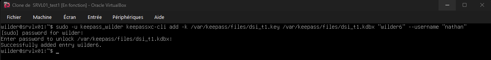

## 13. Pour ajouter des informations à l'utilisateur par exemple mail ou  téléphone

- *Entre cette commande :*

wilder@srvlx01:~$ sudo -u keepass_wilder keepassxc-cli edit -k /var/keepass/files/dsi_t1.key /var/keepass/files/dsi_t1.kdbx "wilder6" --notes "mail:nathan@proton.com\nTél: 06-47-13-48-19"

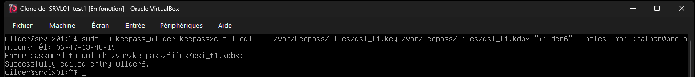

## 14. Pour vérifier les entrées dans la base de données

- *Entre cette commande :*

wilder@srvlx01:~$ sudo -u keepass_wilder keepassxc-cli ls -k /var/keepass/files/dsi_t1.key /var/keepass/files/dsi_t1.kdbx

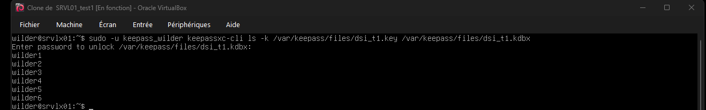

## 15. Pour afficher un utilsateur spécifique

- *Entre cette commande :*

wilder@srvlx01:~$ sudo -u keepass_wilder keepassxc-cli show -k /var/keepass/files/dsi_t1.key /var/keepass/files/dsi_t1.kdbx wilder6

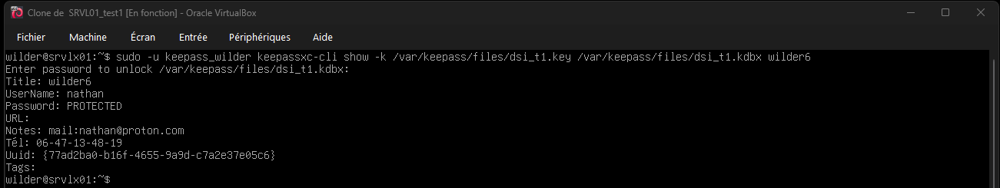

## 16. Attribution des droits d'accès au client wilder 

- *Entre cette commande :*

wilder@srvlx01:~$ sudo chown -R keepass_wilder:wilder /var/keepass/files

## 17.Donne des droits de lecture/écriture/exécution au groupe

- *Entrez cette commande :*

wilder@srvlx01:~$ sudo chmod -R 770 /var/keepass/files

## 18. Pour vérifier les droits

- *Entrez cette commande :*

wilder@srvlx01:~$ sudo ls -l /var/keepass/files

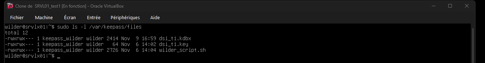

## Installation sur le serveur Windown SRVWIN01

## Étape 1 : Installation de KeePassXC sur WIN01

1. Télécharge et installe Keepassxc sur windows server
https://keepassxc.org/download
2. Lancez l'application Keepassxc

## Étap 2 : Création de la base de données

1. Clique sur **Create Database** dans l'écran d'accueil
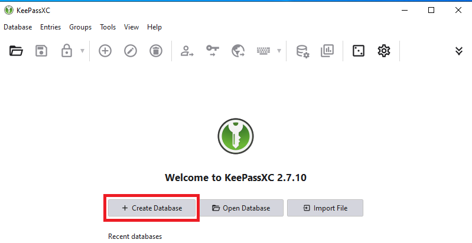

2. Entre les informations de la DB et clique sur continue
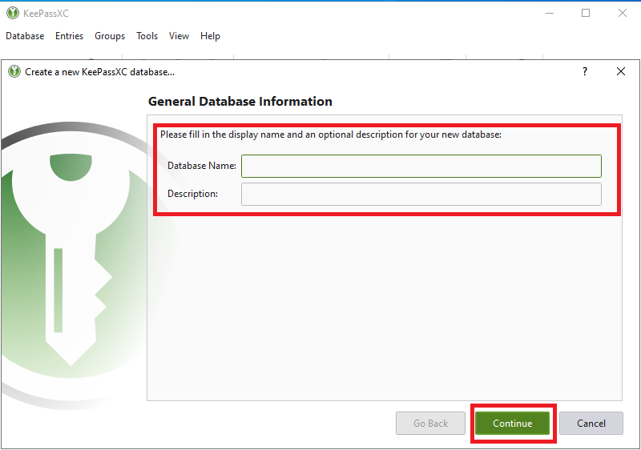

3. Choisis le format **KDBX4**
4. Régle le temps de décryptage si besoin et clique sur **continue** 
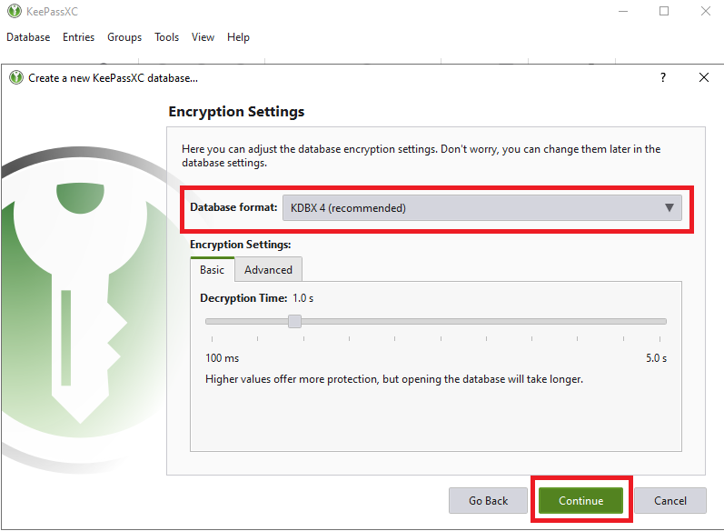

## Étape 3 : Configuration des identifiants

1. Entre un mot de passe principal fort 
2. Confirme le mot de passe
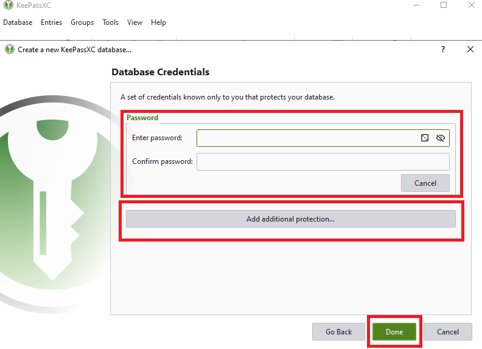

3. Clique sur **Add additional protection** pour renforcer la sécurité
4. Dans la section Key File, clique sur **Generate**
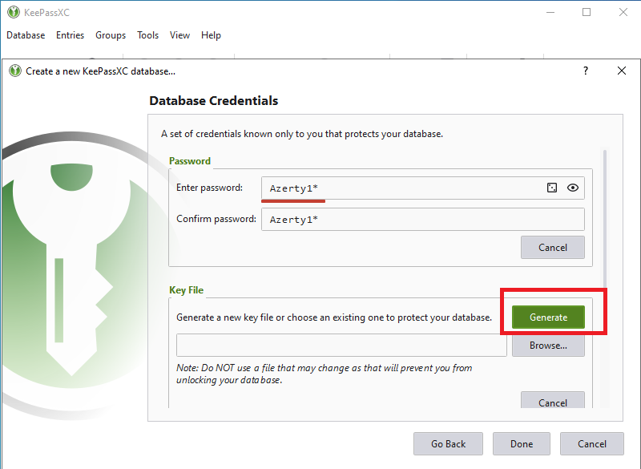

5. Enregistre le fichier clé  dans ton dossier ou un emplacement securisé  
6. Clique sur **Done**
7. L'interface keepass s'ouvre et tu pourras rajouter des données 
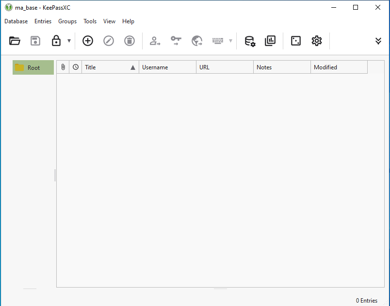

## Étape 4 : Préparation du partage réseau

1. Dans l'explorateur de fichier , ouvre ton dossier keepass a partager
2. Fait un clic droit sur le dossier puis  **Properties**  et  **Sharing**
3. Entre le mot de passe administrateur

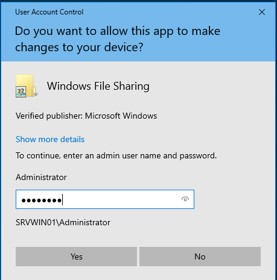

4. Clique sur Advanced sharing et coche Share this folder 

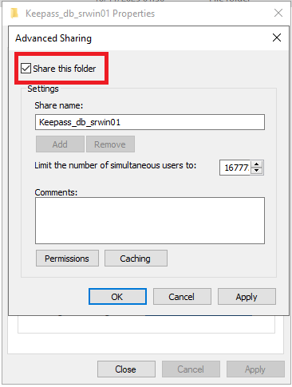

5. Clique sur **Permissions**
6. Sélectionne  le groupe **Everyone**
7. Accorde les permissions :
    - Coche : **Full Control** 
    - Coche : **Change** 
    - Coche : **Read** 
8. Clique sur Aplly et  OK 

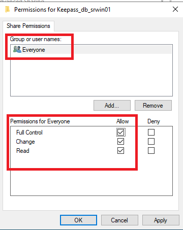

# 3. Installation sur les clients

# Configuration du client UBU01

## 1. Mise à jour du système et installation de sshfs et keepassxc

- *Entre cette commande :*

wilder@ubu01:~$ sudo apt update && sudo apt install -y sshfs keepassxc

## 2. Création d'un point de montage

Créer le dossier local où sera montée la base de données distante.

- *Entre cette commande :*

wilder@ubu01:~$ mkdir -p ~/keepass_srvlx01

## 3. Montage du dossier distant SSHFS

- *Entre cette commande :*

wilder@ubu01:~$ sshfs wilder@172.16.10.6:/var/keepass/files ~/keepass_srvlx01

## 4. Vérification du montage et des droits

- *Entre cette commande :*

wilder@ubu01:~$ ls -l ~/keepass_srvlx01

 dsi_t1.kdbx et dsi_t1.key 

## 5.Liste les entrées de la DB

Affiche les entrées,il demandera le mot de passe principal **keepass_wilder**.

- *Entre cette commande :*

wilder@ubu01:~$ keepassxc-cli ls -k ~/keepass_srvlx01/dsi_t1.key ~/keepass_srvlx01/dsi_t1.kdbx

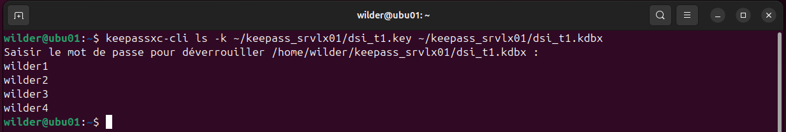

## 6.Liste une entrée specifique par exemple wilder1

- *Entre cette commande :*

wilder@ubu01:~$ keepassxc-cli show -k ~/keepass_srvlx01/dsi_t1.key ~/keepass_srvlx01/dsi_t1.kdbx wilder1 

# Configuration du client WIN01

**Télécharge WinSCP depuis le lien ci-dessous et installe-le avec les paramètres par défaut** 

https://winscp.net/eng/download.php

#### **Étape 1 : Connexion au serveur SRVLX01 via winSCP**

1. Lance winSCP depuis le menu Démarrer
2. Dans la fenêtre session entre les données demander
3. Clique sur **Connexion** pour te connecter au serveur

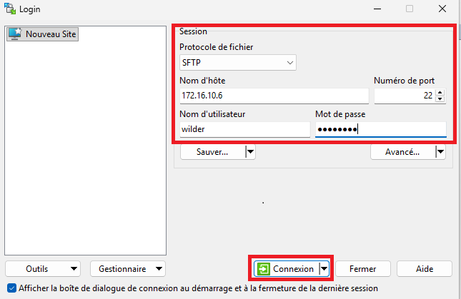

#### **Étape 2 : Entrée dans le dossier  KeePass_DB**

1. Une fois connecté, sur la  droite  :
    - Accède au dossier  keepass_db .

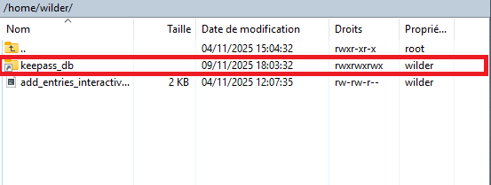

2. Tu devrais voir les fichiers suivants :
    - **dsi_t1.kdbx** : La base de données KeePass.
    - **dsi_t1.key** : La clé de chiffrement associée.
3. Sélectionne les deux fichier

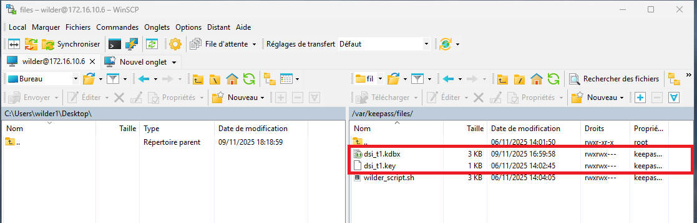

#### **Étape 3 : Copier et coller les  fichiers sur ton PC local**

1. Fais glisser **dsi_t1.kdbx** et **dsi_t1.key**  vers le panneau de gauche ton PC local,   C:\Users\wilder\Desktop
2. Vérifie que les fichiers sont bien présents dans le dossier de destination.

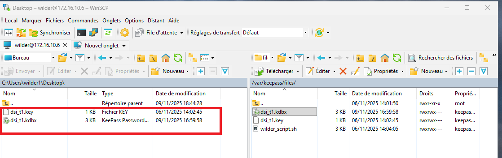

#### **Étape 4 : Ouverture de la base de données avec KeePassXC**

1. Lance KeePassXC depuis ton pc  Windows.
2. Dans l’interface de KeePassXC :
    - Clique sur **Ouvrir une base de données**.

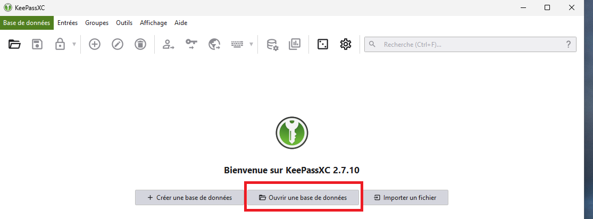
    
3. Dans la fenêtre d’ouverture :
    - Sélectionne le fichier **dsi_t1.kdbx** que tu as coller.
    - Clique sur **Ouvrir**.

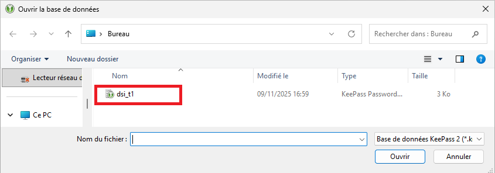

4. Pour sélectionner le fichier clé :
    - Clique sur **Parcourir** à côté de Sélectionner le fichier clé.
    - Choisis le fichier **dsi_t1.key** que tu as téléchargé.

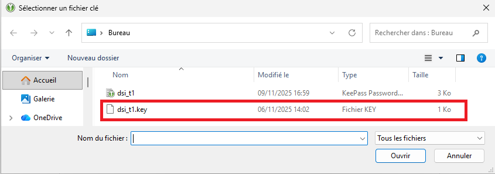

5. Une fenêtre te demande de :
    - Saisir le mot de passe de la base de données.

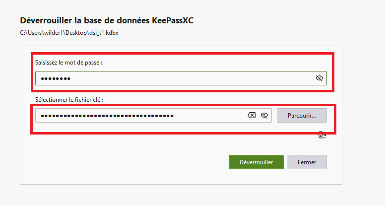

6. Clique sur **Déverrouiller** pour accéder à la base.

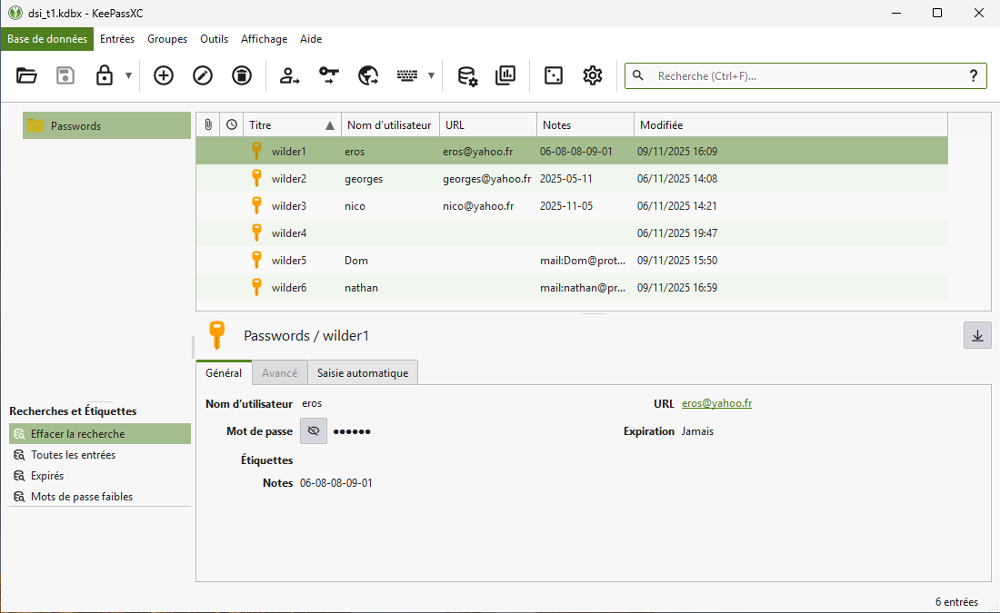

# 4. FAQ

