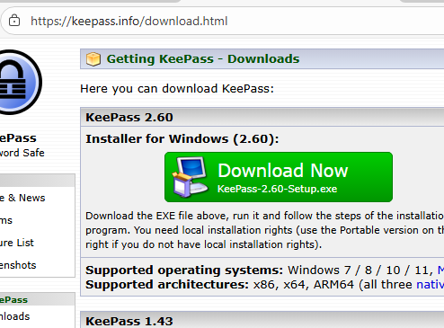
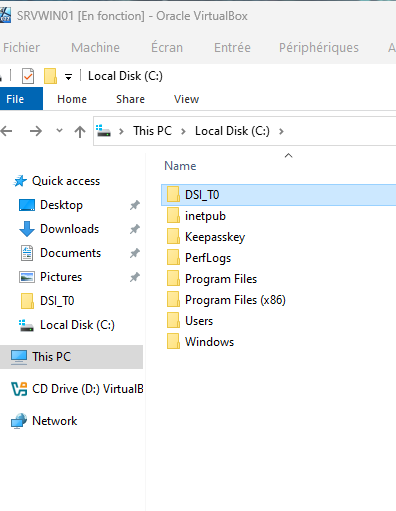
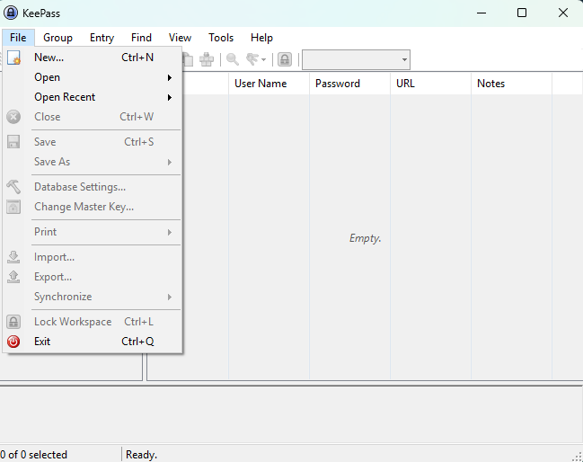
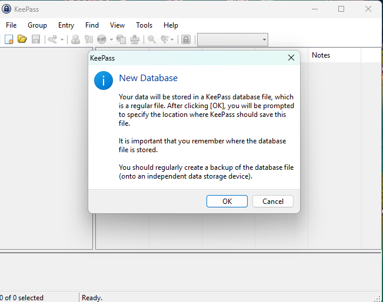
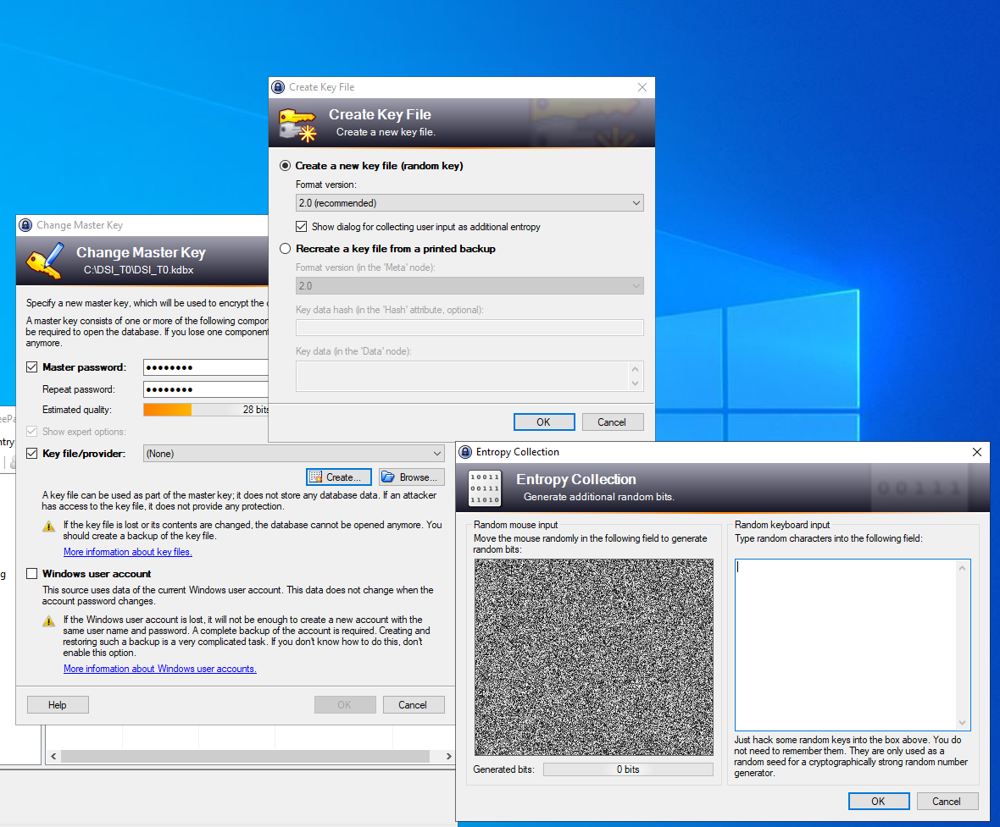
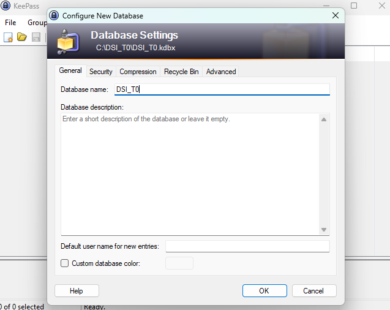
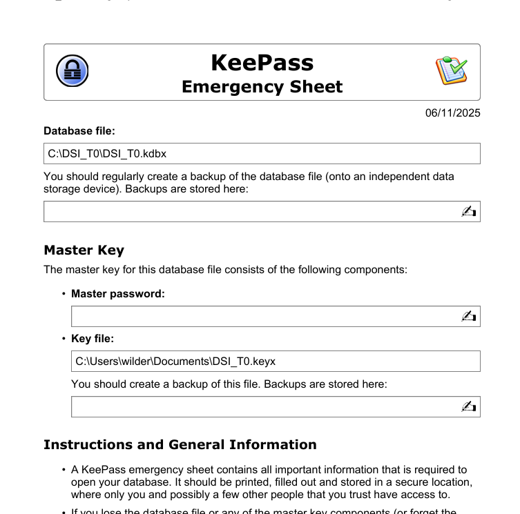
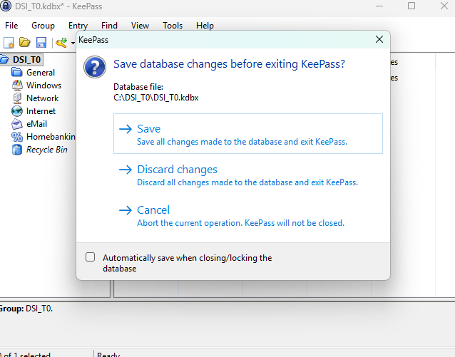
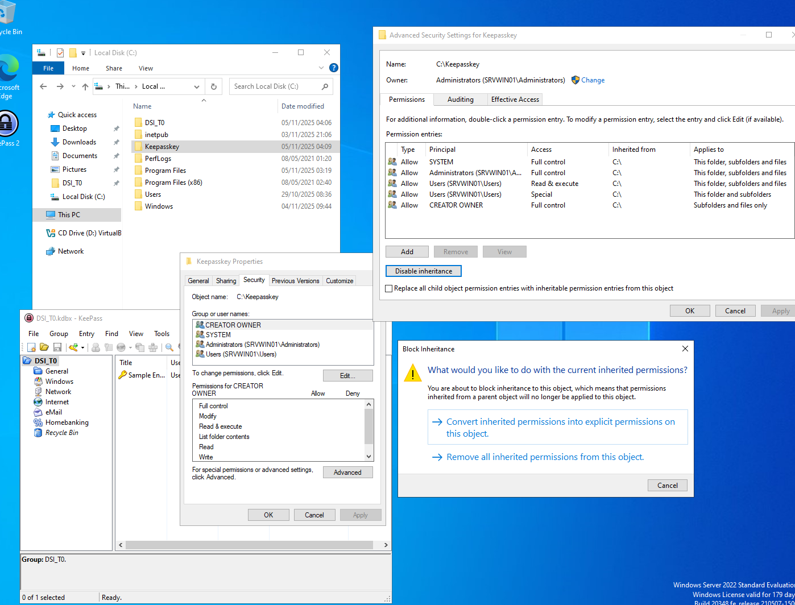
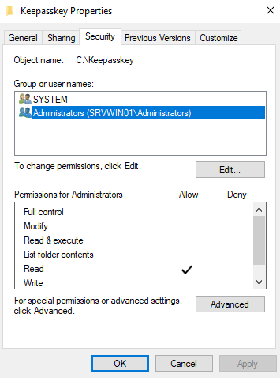

## Sommaire

1. [Prérequis technique](#prerequis-technique)
2. [Installation sur les serveurs](#installation-sur-le-serveur)
3. [Installation sur les clients](#installation-sur-le-client)
4. [FAQ](#faq)

# 1. Prérequis techniques
<span id="prerequis-techniques"></span>
**Étapes 1 :**

  -crée quatre machines virtuelles :

| Machine Virtuelle | Système d'Exploitation   | NOM      |
| ----------------- | ------------------------ | -------- |
| VM 1              | Debian 12/13             | SRVLX01  |
| VM 2              | Windows Server 2022/2025 | SRVWIN01 |
| VM 3              | Ubuntu 24 LTS            | UBU01    |
| VM 4              | Windows 10/11            | WIN01    |

**Étapes 2 :**

   - Mets les quatre machines  en réseau → rajoute une 2e carte réseau en "réseau interne", avec le même nom "intnet".

   - Configure l'adresse IP de la deuxième carte réseau sur les quatre machines

| VM       | Système d'Exploitation       | Carte_réseau_1 | Carte_réseau_2/Réseau_Interne   | IP           |
| -------- | ---------------------------- | -------------- | ------------------------------- | ------------ |
| SRVLX01  | Debian 12/13 CLI             | NAT            | intnet                          | 172.16.10.6  |
| SRVWIN01 | Windows Server 2022/2025 GUI | NAT            | intnet                          | 172.16.10.5  |
| UBU01    | Ubuntu 24 LTS                | NAT            | intnet                          | 172.16.10.20 |
| WIN01    | Windows 10/11                | NAT            | intnet                          | 172.16.10.10 |

# 2. Installation sur les serveurs
<span id="installation-sur-le-serveur"></span>

## Installation sur le serveur Debian 12/13 (CLI)

## 1. Mise à jour du système avant l’installation de KeePass :

- *Entre cette commande :*

wilder@srvlx01:~$ sudo apt update && sudo apt upgrade -y


## 2. Installation de KeePassXC et vérification de la version

- *Entre cette commande :*

 wilder@srvlx01:~$ sudo apt install -y keepassxc && keepassxc-cli --version


## 3. Création de l'utilisateur système "keepass_wilder"

- *Entre cette commande :*

wilder@srvlx01:~$ sudo useradd -r -s /usr/sbin/nologin keepass_wilder

## 4. Création du dossier keepass dans /var

- *Entre cette commande :*

wilder@srvlx01:~$ sudo mkdir -p /var/keepass/files

## 5. Donne tous les droits a keepass_wilder pour être propriétaire

- *Entre cette commande :* 

wilder@srvlx01:~$ sudo chown keepass_wilder:keepass_wilder /var/keepass/files

## 6.Donne les droits de lecture, écriture et d'exécution a keepass_wilder

- *Entre cette commande :*

wilder@srvlx01:~$ sudo chmod 700 /var/keepass/files


## 7. Génération de la clé de chiffrement

- *Entre cette commande :*

wilder@srvlx01:~$ sudo -u keepass_wilder bash -c 'dd if=/dev/urandom of=/var/keepass/files/dsi_t1.key bs=64 count=1 status=none'

## 8.Donne les droits pour que seule keepass_wilder puisse lire la clé 

- *Entre cette commande :*

wilder@srvlx01:~$ sudo chmod 600 /var/keepass/files/dsi_t1.key

## 9.Donne tous les droits a keepass_wilder pour être propriétaire

- *Entre cette commande :*

wilder@srvlx01:~$ sudo chown keepass_wilder:keepass_wilder /var/keepass/files/dsi_t1.key


## 10.créer la base KeePass et définit le mot de passe pour Keepass_wilder

- *Entre cette commande :*

wilder@srvlx01:~$ sudo -u keepass_wilder keepassxc-cli db-create /var/keepass/files/dsi_t1.kdbx --set-key-file /var/keepass/files/dsi_t1.key --set-password

## 11. Vérification des informations de la base de données

- *Entre cette commande :*

wilder@srvlx01:~$ sudo -u keepass_wilder keepassxc-cli db-info -k /var/keepass/files/dsi_t1.key /var/keepass/files/dsi_t1.kdbx


La base de données est crée et sécurisée. On peut  maintenant créer des comptes et y stocker des informations. Plusieurs solutions s’offrent à nous : soit créer les utilisateurs manuellement, soit utiliser un script pour automatiser cette tâche.


## 12. Création d'un utilisateur manuellement

- *Entre cette commande :*

wilder@srvlx01:~$ sudo -u keepass_wilder keepassxc-cli add -k /var/keepass/files/dsi_t1.key /var/keepass/files/dsi_t1.kdbx "wilder6" --username "nathan"


## 13. Pour ajouter des informations à l'utilisateur par exemple mail ou  téléphone

- *Entre cette commande :*

wilder@srvlx01:~$ sudo -u keepass_wilder keepassxc-cli edit -k /var/keepass/files/dsi_t1.key /var/keepass/files/dsi_t1.kdbx "wilder6" --notes "mail:nathan@proton.com\nTél: 06-47-13-48-19"


## 14. Pour vérifier les entrées dans la base de données

- *Entre cette commande :*

wilder@srvlx01:~$ sudo -u keepass_wilder keepassxc-cli ls -k /var/keepass/files/dsi_t1.key /var/keepass/files/dsi_t1.kdbx


## 15. Pour afficher un utilsateur spécifique

- *Entre cette commande :*

wilder@srvlx01:~$ sudo -u keepass_wilder keepassxc-cli show -k /var/keepass/files/dsi_t1.key /var/keepass/files/dsi_t1.kdbx wilder6


## 16. Attribution des droits d'accès au client wilder 

- *Entre cette commande :*

wilder@srvlx01:~$ sudo chown -R keepass_wilder:wilder /var/keepass/files

## 17.Donne des droits de lecture/écriture/exécution au groupe

- *Entrez cette commande :*

wilder@srvlx01:~$ sudo chmod -R 770 /var/keepass/files

## 18. Pour vérifier les droits

- *Entrez cette commande :*

wilder@srvlx01:~$ sudo ls -l /var/keepass/files


## Installation sur le serveur Windown SRVWIN01

## 1. Installation du logiciel

### 1.1 Téléchargement

- Accéder au site officiel : [https://keepass.info/](https://keepass.info/)
- Télécharger la version **2.6**

### 1.2 Configuration de l'installation

- **Chemin d'installation** : `C:\Program Files\KeePass Password Safe 2\KeePass.exe`
- **Type d'installation** : Installation complète



---

## 2. Préparation de l'environnement

### 2.1 Création du dossier de stockage

Créer un dossier `DSI_T0` à la racine du disque C: pour héberger :

- La base de données KeePass (.kdbx)
- Le fichier de clé crypté (.keyx)

```
C:\DSI_T0\
```

---

## 3. Création de la base de données

### 3.1 Initialisation

1. Lancer KeePass depuis le bureau
2. Créer une nouvelle base : **File → New**
3. Prendre connaissance des recommandations de sécurité et de sauvegarde


 
 
 ### 3.2 Enregistrement

Enregistrer la base de données dans le dossier créé précédemment :

```
C:\DSI_T1\DSI_T0.kdbx
```

---

## 4. Configuration de la sécurité

### 4.1 Master Password

- Définir un mot de passe maître robuste
- **Recommandation** : Utiliser le générateur de mots de passe de KeePass ou un outil tiers spécialisé
- **Pour cet exercice** : Utiliser le mot de passe standard de la session de formation

### 4.2 Double authentification (Key File)

1. Cocher l'option **"Key file/provider"** pour ajouter une couche de sécurité supplémentaire
2. Générer le fichier de clé avec la méthode **"Random mouse input"**
3. Le fichier `DSI_T0.keyx` est automatiquement créé dans `C:\DSI_T0\`


### 4.3 Options BDD

La Double authentification créee une nouvelle fenêtre vous propose différentes options parmis lesquelles.

1. Général 
 Nom et Description : pour nommer votre bdd et la décrire
 Historique : Gère le nombre de versions antérieures stockées

2. Sécurité (Security)
 Algorithmes : Choix de l'algorithme de chiffrement (ex. AES-256) 

 Transformation de Clé : Définit le nombre d'itérations pour ralentir le processus d'ouverture.

3. Compression (Compression)
 Algorithme : Choisit une méthode de compression .

4. Modèles (Templates)
 Création Rapide : Permet de définir des modèles

 Uniformité : Assure la cohérence des informations lors de la création de nouvelles entrées.
 

### 4.4 Impression fiche d'urgence et Sauvegarde

 Une fois les options choisies et validées vous avez la possibilité d'imprimer une fiche d'urgence fournissant les informationss cruciales pour l'accès à votre base de données.

 


 ### Fermer l'application en sauvegardant
 
 


### 4.5 Vérification

Vissualisez la présence des fichiers suivants dans `C:\DSI_T0\` :

- `DSI_T0.kdbx` (base de données)
- `DSI_T0.keyx` (fichier de clé)
  
---

## 5. Sécurisation avancée du fichier de clé

### 5.1 Objectif

Protéger le fichier de clé contre :

- La perte accidentelle
- Les accès non autorisés
- Le piratage

### 5.2 Création d'un dossier sécurisé

1. Créer un dossier `Keepasskey`
2. Déplacer le fichier `.keyx` dans ce dossier

### 5.3 Configuration des permissions

#### Conversion des autorisations héritées

1. Ouvrir les **Propriétés** du dossier → Onglet **Sécurité**
2. Cliquer sur **Avancé**
3. **Désactiver l'héritage** et convertir les autorisations héritées en permissions explicites

#### Application des restrictions

Configurer les permissions comme suit :

|Compte|Permissions|
|---|---|
|**SYSTEM**|Contrôle total (Full Control)|
|**Administrators**|Lecture seule (Read)|
|**Autres comptes**|❌ Supprimer tous les accès|

#### Vérification

1. Rouvrir les **Propriétés** du dossier
2. Vérifier que seuls SYSTEM et Administrators apparaissent
3. Confirmer les niveaux d'accès définis
4. Sauvegarder le fichier DSI_T0.keyx dans ce dossier

---

## 6. Résultat final

La configuration mise en place garantit :

- ✅ Une base de données protégée par mot de passe maître
- ✅ Une double authentification via fichier de clé
- ✅ Des permissions restrictives sur les fichiers sensibles
- ✅ Une séparation physique entre la base et le fichier de clé

---

# 3. Installation sur les clients

<span id="installation-sur-le-client"></span>

# Configuration du client UBU01

## 1. Mise à jour du système et installation de sshfs et keepassxc

- *Entre cette commande :*

wilder@ubu01:~$ sudo apt update && sudo apt install -y sshfs keepassxc


## 2. Création d'un point de montage

Créer le dossier local où sera montée la base de données distante.

- *Entre cette commande :*

wilder@ubu01:~$ mkdir -p ~/keepass_srvlx01


## 3. Montage du dossier distant SSHFS

- *Entre cette commande :*

wilder@ubu01:~$ sshfs wilder@172.16.10.6:/var/keepass/files ~/keepass_srvlx01

## 4. Vérification du montage et des droits

- *Entre cette commande :*

wilder@ubu01:~$ ls -l ~/keepass_srvlx01

 dsi_t1.kdbx et dsi_t1.key 


## 5.Liste les entrées de la DB

Affiche les entrées,il demandera le mot de passe principal **keepass_wilder**.

- *Entre cette commande :*

wilder@ubu01:~$ keepassxc-cli ls -k ~/keepass_srvlx01/dsi_t1.key ~/keepass_srvlx01/dsi_t1.kdbx


## 6.Liste une entrée specifique par exemple wilder1

- *Entre cette commande :*

wilder@ubu01:~$ keepassxc-cli show -k ~/keepass_srvlx01/dsi_t1.key ~/keepass_srvlx01/dsi_t1.kdbx wilder1 


# Configuration du client WIN01

**Télécharge et installe les outils suivants  avec les paramètres par défaut** 

- WINSCP :  https://winscp.net/eng/download.php

- KEEPASSXC : (https://keepassxc.org/download/#windows)

#### **Étape 1 : Connexion au serveur SRVLX01 via winSCP**

1. Lance winSCP depuis le menu Démarrer
2. Dans la fenêtre session entre les données demander
    - Nom d’hôte : 172.16.10.6
    - Nom d’utilisateur : nom_utilisateur_linux(wilder)
    - Mot de passe : Saisie le mot de passe associé à l’utilisateur.
    - Protocole : Choisit SFTP port 22 par défaut
  
3. Clique sur **Connexion** pour te connecter au serveur


#### **Étape 2 : Entre  dans le dossier  KeePass_DB**

1. Une fois connecté, sur la  droite  :

    - Accède au dossier  keepass_db .


2. Tu devrais voir les fichiers suivants :
    - **dsi_t1.kdbx** : La base de données KeePass.
    - **dsi_t1.key** : La clé de chiffrement associée.
3. Sélectionne les deux fichier


#### **Étape 3 : Copier et coller les  fichiers sur ton PC local**

1. Fais glisser **dsi_t1.kdbx** et **dsi_t1.key**  vers le panneau de gauche ton PC local,   C:\Users\wilder\Desktop
2. Vérifie que les fichiers sont bien présents dans le dossier de destination.


#### **Étape 4 : Ouverture de la base de données avec KeePassXC**

1. Lance KeePassXC depuis ton pc  Windows.
2. Dans l’interface de KeePassXC :
    - Clique sur **Ouvrir une base de données**.


    
3. Dans la fenêtre d’ouverture :
    - Sélectionne le fichier **dsi_t1.kdbx** que tu as coller.
    - Clique sur **Ouvrir**.


4. Pour sélectionner le fichier clé :
    - Clique sur **Parcourir** à côté de Sélectionner le fichier clé.
    - Choisis le fichier **dsi_t1.key** que tu as téléchargé.


5. Une fenêtre te demande de saisir le mot de passe de la base de données.


6. Clique sur **Déverrouiller** pour accéder à la base.


Après avoir ouvert la base de données avec Keepassxc, tu peux ajouter, créer ou modifier des entrées utilisateurs et mots de passe.

# 4. FAQ
<span id="faq"></span>
Cette FAQ aborde les problèmes potentiels et questions techniques courantes lors de la mise en place de KeePass sur différents systèmes. Elle se concentre sur les dépannages pour une installation réussie.

## Sur Windows Server

**Q1 : Que faire si l'installation échoue à cause de .NET Framework ?**  
Vérifiez que .NET Framework 4.8 est installé via le Gestionnaire de serveur. Téléchargez-le depuis le site Microsoft si nécessaire et relancez l'installation.

**Q2 : KeePass est-il compatible avec les rôles serveur comme Active Directory ?**  
Oui, mais exécutez-le via une session Remote Desktop pour éviter les conflits avec les services serveur. Testez en mode compatibilité si des erreurs surgissent.

## Sur Linux Debian

**Q1 : Que faire en cas d'erreur liée à Mono lors du lancement ?**  
Mettez à jour Mono avec `sudo apt update && sudo apt upgrade mono-complete`. Vérifiez les logs dans le terminal pour des détails spécifiques.

**Q2 : Problèmes de permissions pour les bases de données KeePass ?**  
Assurez-vous que l'utilisateur a les droits en lecture/écriture sur le dossier des fichiers .kdbx. Évitez de lancer en root pour des raisons de sécurité.

## Sur Windows 11 (VM Client)

**Q1 : Pourquoi KeePass est-il lent dans une VM Windows 11 ?**  
Allouez plus de RAM et CPU à la VM via les paramètres de l'hyperviseur. Désactivez les effets graphiques inutiles dans Windows pour améliorer les performances.

**Q2 : Erreurs de synchronisation avec des plugins comme KeeAnywhere ?**  
Vérifiez la connexion réseau de la VM et mettez à jour les plugins. Testez sans plugins pour isoler le problème, souvent lié à des certificats SSL.

## Sur Linux Ubuntu (VM Client)

**Q1 : Que faire si KeePass ne s'ouvre pas après installation dans une VM Ubuntu ?**  
Installez les dépendances manquantes comme `mono-complete` et `xdotool` via apt. Relancez et vérifiez les erreurs dans le terminal.

**Q2 : Problèmes d'intégration avec le clipboard dans une VM ?**  
Installez les outils invités de votre hyperviseur (ex. : VirtualBox Guest Additions) pour une meilleure gestion du presse-papiers partagé.
