## Sommaire

1. [Prérequis technique](#prerequis-technique)
2. [Installation sur le serveur](#installation-sur-le-serveur)
3. [Installation sur le client](#installation-sur-le-client)
4. [FAQ](#faq)

# 1. Prérequis techniques
<span id="prerequis-techniques"></span>

# 2. Installation sur le serveur
<span id="installation-sur-le-serveur"></span>
# Guide d'installation KeePass sur Windows Server 2022

## Vue d'ensemble

Ce guide décrit la procédure d'installation et de configuration sécurisée de KeePass Password Safe 2.6 sur Windows Server 2022.

---

## 1. Installation du logiciel

### 1.1 Téléchargement

- Accéder au site officiel : [https://keepass.info/](https://keepass.info/)
- Télécharger la version **2.6**

### 1.2 Configuration de l'installation

- **Chemin d'installation** : `C:\Program Files\KeePass Password Safe 2\KeePass.exe`
- **Type d'installation** : Installation complète


---

## 2. Préparation de l'environnement

### 2.1 Création du dossier de stockage

Créer un dossier `DSI_T0` à la racine du disque C: pour héberger :

- La base de données KeePass (.kdbx)
- Le fichier de clé crypté (.keyx)

```
C:\DSI_T0\
```
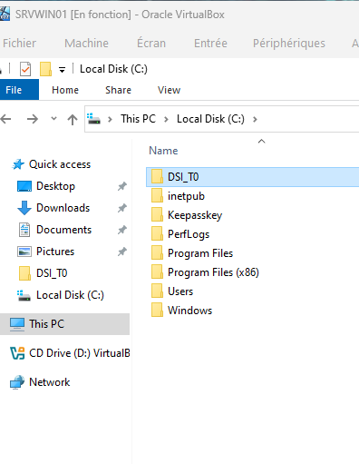
---

## 3. Création de la base de données

### 3.1 Initialisation

1. Lancer KeePass depuis le bureau
2. Créer une nouvelle base : **File → New**
3. Prendre connaissance des recommandations de sécurité et de sauvegarde
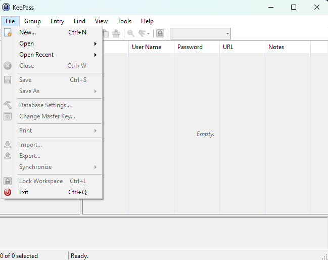
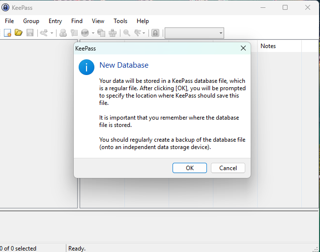
 
 
 ### 3.2 Enregistrement

Enregistrer la base de données dans le dossier créé précédemment :

```
C:\DSI_T1\DSI_T0.kdbx
```
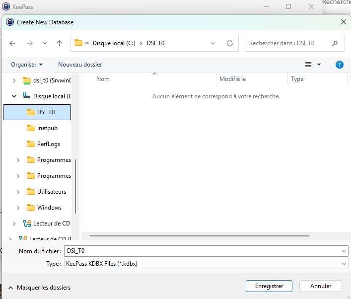
---

## 4. Configuration de la sécurité

### 4.1 Master Password

- Définir un mot de passe maître robuste
- **Recommandation** : Utiliser le générateur de mots de passe de KeePass ou un outil tiers spécialisé
- **Pour cet exercice** : Utiliser le mot de passe standard de la session de formation

### 4.2 Double authentification (Key File)

1. Cocher l'option **"Key file/provider"** pour ajouter une couche de sécurité supplémentaire
2. Générer le fichier de clé avec la méthode **"Random mouse input"**
3. Le fichier `DSI_T0.keyx` est automatiquement créé dans `C:\DSI_T0\`
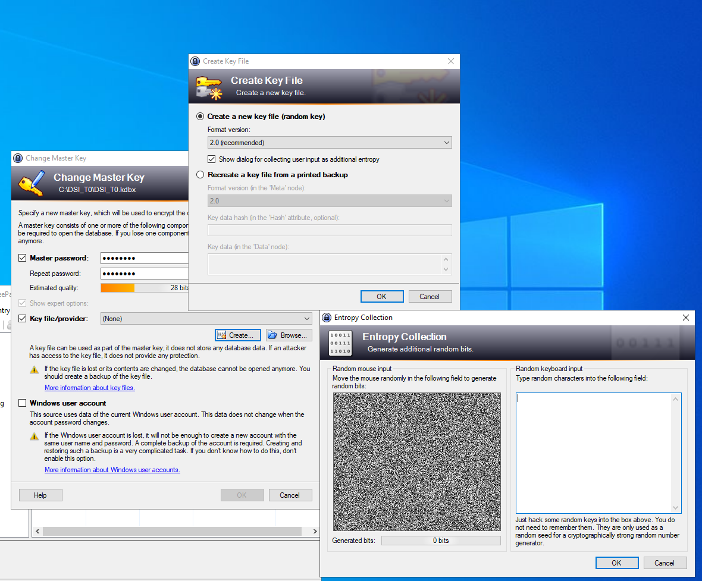

### 4.3 Options BDD

La Double authentification créee une nouvelle fenêtre vous propose différentes options parmis lesquelles.

1. Général 
 Nom et Description : pour nommer votre bdd et la décrire
 Historique : Gère le nombre de versions antérieures stockées

2. Sécurité (Security)
 Algorithmes : Choix de l'algorithme de chiffrement (ex. AES-256) 

 Transformation de Clé : Définit le nombre d'itérations pour ralentir le processus d'ouverture.

3. Compression (Compression)
 Algorithme : Choisit une méthode de compression .

4. Modèles (Templates)
 Création Rapide : Permet de définir des modèles

 Uniformité : Assure la cohérence des informations lors de la création de nouvelles entrées.
 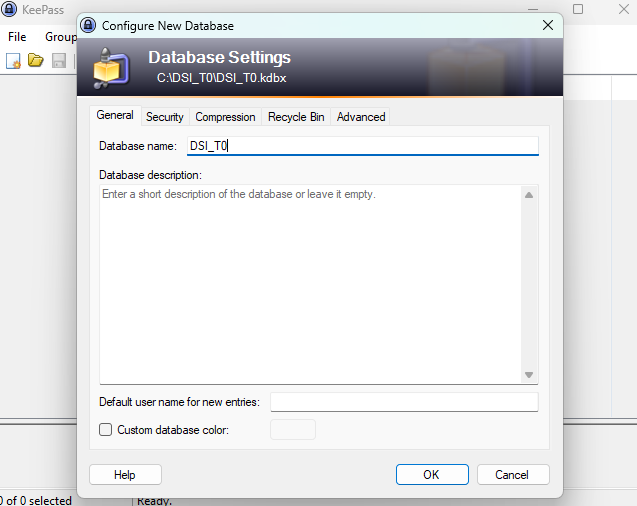

### 4.4 Impression fiche d'urgence et Sauvegarde

 Une fois les options choisies et validées vous avez la possibilité d'imprimer une fiche d'urgence fournissant les informationss cruciales pour l'accès à votre base de données.

 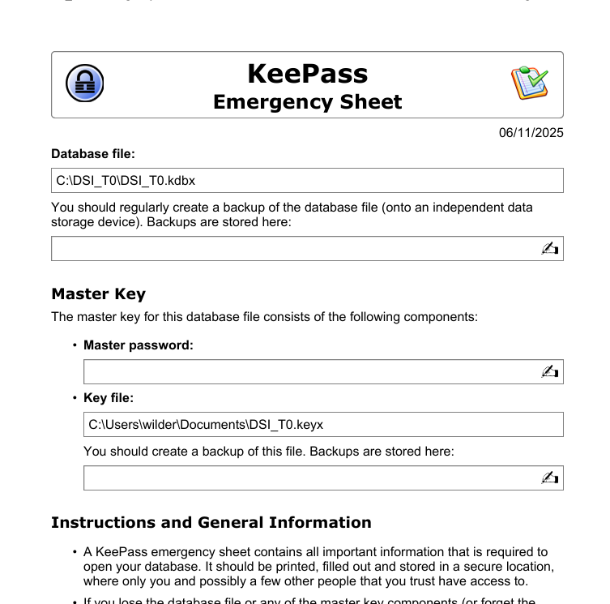


 ### Fermer l'application en sauvegardant
 
 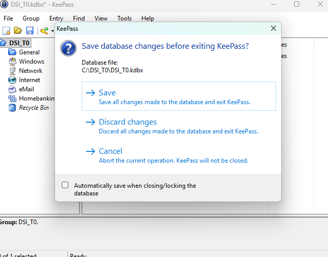


### 4.5 Vérification

Vissualisez la présence des fichiers suivants dans `C:\DSI_T0\` :

- `DSI_T0.kdbx` (base de données)
- `DSI_T0.keyx` (fichier de clé)
  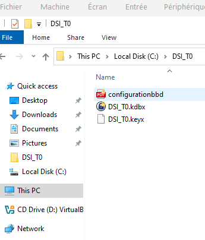
---

## 5. Sécurisation avancée du fichier de clé

### 5.1 Objectif

Protéger le fichier de clé contre :

- La perte accidentelle
- Les accès non autorisés
- Le piratage

### 5.2 Création d'un dossier sécurisé

1. Créer un dossier `Keepasskey`
2. Déplacer le fichier `.keyx` dans ce dossier

### 5.3 Configuration des permissions

#### Conversion des autorisations héritées

1. Ouvrir les **Propriétés** du dossier → Onglet **Sécurité**
2. Cliquer sur **Avancé**
3. **Désactiver l'héritage** et convertir les autorisations héritées en permissions explicites
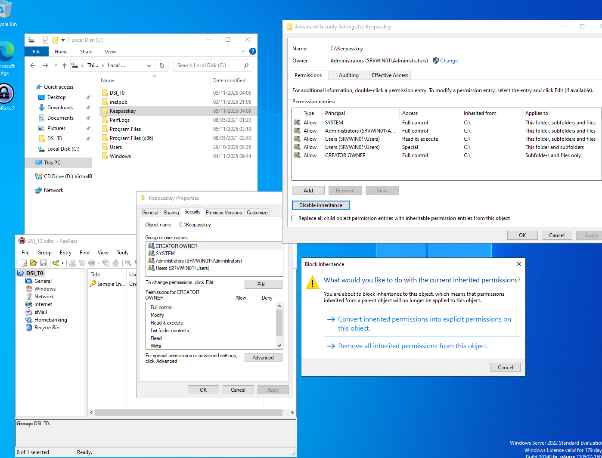
#### Application des restrictions

Configurer les permissions comme suit :

|Compte|Permissions|
|---|---|
|**SYSTEM**|Contrôle total (Full Control)|
|**Administrators**|Lecture seule (Read)|
|**Autres comptes**|❌ Supprimer tous les accès|

#### Vérification

1. Rouvrir les **Propriétés** du dossier
2. Vérifier que seuls SYSTEM et Administrators apparaissent
3. Confirmer les niveaux d'accès définis
4. Sauvegarder le fichier DSI_T0.keyx dans ce dossier
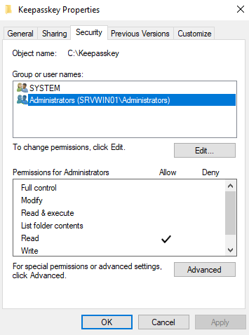
---

## 6. Résultat final

La configuration mise en place garantit :

- ✅ Une base de données protégée par mot de passe maître
- ✅ Une double authentification via fichier de clé
- ✅ Des permissions restrictives sur les fichiers sensibles
- ✅ Une séparation physique entre la base et le fichier de clé

---

## Notes importantes

> **⚠️ Sauvegarde** : Mettre en place une stratégie de sauvegarde régulière de la base de données et du fichier de clé sur un support externe sécurisé.

> **⚠️ Documentation** : Conserver le mot de passe maître dans un lieu sûr (coffre-fort physique, gestionnaire de secrets d'entreprise).

> **⚠️ Accès** : Sans le mot de passe maître ET le fichier de clé, l'accès à la base de données est impossible.

---

**Version** : 1.0  
**Date** : Novembre 2024  
**Logiciel** : KeePass Password Safe 2.6  
**Système** : Windows Server 2022


# 3. Installation sur le client
<span id="installation-sur-le-client"></span>

# 4. FAQ
<span id="faq"></span>

Cette FAQ aborde les problèmes potentiels et questions techniques courantes lors de la mise en place de KeePass sur différents systèmes. Elle se concentre sur les dépannages pour une installation réussie.

## Sur Windows Server

**Q1 : Que faire si l'installation échoue à cause de .NET Framework ?**  
Vérifiez que .NET Framework 4.8 est installé via le Gestionnaire de serveur. Téléchargez-le depuis le site Microsoft si nécessaire et relancez l'installation.

**Q2 : KeePass est-il compatible avec les rôles serveur comme Active Directory ?**  
Oui, mais exécutez-le via une session Remote Desktop pour éviter les conflits avec les services serveur. Testez en mode compatibilité si des erreurs surgissent.

## Sur Linux Debian

**Q1 : Que faire en cas d'erreur liée à Mono lors du lancement ?**  
Mettez à jour Mono avec `sudo apt update && sudo apt upgrade mono-complete`. Vérifiez les logs dans le terminal pour des détails spécifiques.

**Q2 : Problèmes de permissions pour les bases de données KeePass ?**  
Assurez-vous que l'utilisateur a les droits en lecture/écriture sur le dossier des fichiers .kdbx. Évitez de lancer en root pour des raisons de sécurité.

## Sur Windows 11 (VM Client)

**Q1 : Pourquoi KeePass est-il lent dans une VM Windows 11 ?**  
Allouez plus de RAM et CPU à la VM via les paramètres de l'hyperviseur. Désactivez les effets graphiques inutiles dans Windows pour améliorer les performances.

**Q2 : Erreurs de synchronisation avec des plugins comme KeeAnywhere ?**  
Vérifiez la connexion réseau de la VM et mettez à jour les plugins. Testez sans plugins pour isoler le problème, souvent lié à des certificats SSL.

## Sur Linux Ubuntu (VM Client)

**Q1 : Que faire si KeePass ne s'ouvre pas après installation dans une VM Ubuntu ?**  
Installez les dépendances manquantes comme `mono-complete` et `xdotool` via apt. Relancez et vérifiez les erreurs dans le terminal.

**Q2 : Problèmes d'intégration avec le clipboard dans une VM ?**  
Installez les outils invités de votre hyperviseur (ex. : VirtualBox Guest Additions) pour une meilleure gestion du presse-papiers partagé.
