## Sommaire

1. [Utilisation de base](#utilisation-de-base)
2. [Utilisation avancée](#utilisation-avancee)
3. [Ouverture base de données sous windows 11](#Ouverturebdd-win11)
4. [Ouverture base de données sous ubuntu](#Ouverturebdd-ubuntu)
5. [FAQ](#faq)

# 🔑 Guide Utilisateur de Base KeePass
<span id="utilisation-de-base"></span>

## 1. Création de la base de données

1. Cliquez sur **Fichier** $\rightarrow$ **Nouveau...**

2. Choisissez un emplacement sécurisé sur votre disque dur et renommez le.

3. Saisissez un **Mot de Passe**, le plus long possible mais qui soit facile à retrouver pour vous.

4. Renommez votre base de données.

5. Cliquez sur **OK** pour enregistrer et ouvrir votre nouvelle base de données.

## 2. Ajout de nom d'utilisateurs avec leurs mots de passe

1. Cliquez sur l'icône **Ajouter une nouvelle entrée** (souvent une clé ou un $+$ vert).

2. Remplissez les champs :

    * **Titre** : Nom du site

    * **Nom d'utilisateur** : Votre identifiant pour ce site

    * **Mot de passe** : Votre mot de passe pour ce site

    * **URL** : L'adresse web du site

3. Cliquez sur l'icône du **Générateur de mots de passe**

4. Cliquez sur **OK** pour valider la nouvelle entrée.

## 3. Connexion à un site web

1.  Faites un **clic droit** sur l'entrée désirée.

2.  Choisissez **Copier le nom d'utilisateur** et collez-le dans le formulaire du site.

3.  Faites un clic droit $\rightarrow$ **Copier le mot de passe** et collez-le.
 

## 4. Verrouillage de la base de données

1. Quand vous n'utilisez plus la base de données :
    * Cliquez sur l'icône du **cadenas** : la base est verrouillée et nécessite votre Mot de Passe pour la rouvrir.

    * Ou **Quittez** complètement le logiciel.

# 🛡️ Guide Utilisateur Avancé KeePass
<span id="utilisation-avancee"></span>

## 1. **Intégration au Navigateur**

Possibilité d'intégrer KeePassXC à votre navigateur web pour un remplissage automatique des formulaires de connexion.


1. **Installation des Composants**
 
   - Dans KeePassXC, allez dans **Outils** → **Paramètres** → **Intégration du navigateur**.
    
   - **Cochez** "Activer l'intégration du navigateur KeePassXC" et activez le support     

     pour votre navigateur (Chrome, Firefox, etc.).

   - Téléchargez l'extension KeePassXC-Browser depuis votre navigateur et installez la.

3. **Couplage de la Base de Données**

   - Cliquez sur l'icône de l'extension KeePassXC dans votre navigateur.

   - Entrez un nom de connexion.

   - Une fenêtre pop-up de KeePassXC apparaît. Cliquez sur **Enregistrer et Accéder** 
    
     pour autoriser l'extension à communiquer avec votre base de données ouverte.

## 2. **Stocker des fichiers**

Peut également stocker des fichiers (documents, images, etc.) dans les entrées de votre base de 

données.   
 
   - Dans l'édition d'une entrée, allez dans l'onglet **Avancé**.   
   
   - Cliquez sur **Ajouter** sous la section Pièces jointes.

1. **Vérification de la Robustesse des Mots de Passe**

     Vous avez la possibilité d'auditer votre base de données pour identifier les mots de passe 
     
     faibles, réutilisés ou manquants.

   - Allez dans Base de données → Rapport de la base de données.

   - Le rapport vous montrera :

        - Les mots de passe utilisés plusieurs fois.

        - Les mots de passe faibles (selon une complexité configurable).

        - Les entrées sans URL.


---

# Guide d'utilisation de KeePassXC sous Windows 11
<span id="Ouverturebdd-win11"></span>
## Prérequis

Ce guide suppose que KeePassXC est déjà installé et configuré sur votre système Windows 11.

---

## Ouverture de votre base de données

### Étape 1 : Lancer l'application

Démarrez KeePassXC depuis la barre des tâches Windows 11 ou via le menu Démarrer.

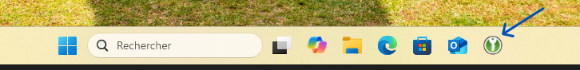


_Figure 1 : Icône KeePassXC dans la barre des tâches Windows 11 (icône verte avec une clé)_

**Méthodes de lancement :**

- Cliquez sur l'icône KeePassXC dans la barre des tâches
- Menu Démarrer → Recherchez "KeePassXC"
- Raccourci sur le bureau (si créé lors de l'installation)

---

### Étape 2 : Ouvrir une base de données existante

Dans la fenêtre principale de KeePassXC, cliquez sur le menu **"Base de données"** puis sélectionnez **"Ouvrir une base de données..."**

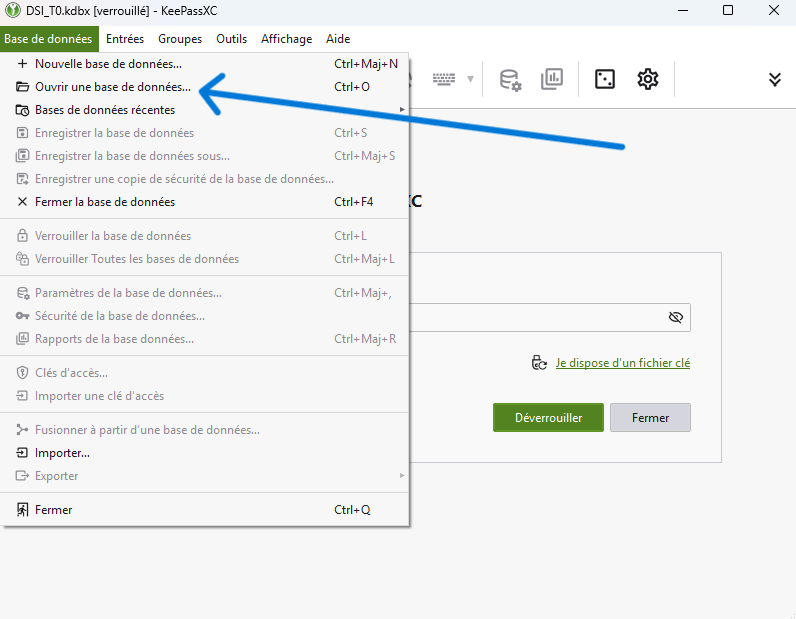


_Figure 2 : Menu "Base de données" avec l'option "Ouvrir une base de données" (Ctrl+O)_

**Méthodes alternatives :**

- Raccourci clavier : `Ctrl + O`
- Menu : **Base de données → Ouvrir une base de données...**
- Lien direct : **"Je dispose d'un fichier clé"** (si affiché dans la fenêtre d'accueil)

---

### Étape 3 : Sélectionner votre base de données

L'explorateur de fichiers Windows s'ouvre. Naviguez jusqu'à l'emplacement de votre fichier de base de données (extension `.kdbx`).

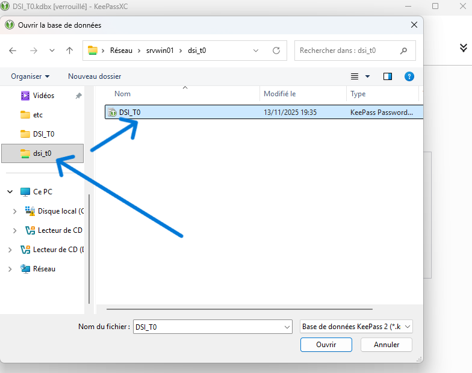


_Figure 3 : Explorateur Windows avec le fichier DSI_T0.kdbx à sélectionner_

**Navigation dans l'explorateur :**

1. Utilisez l'arborescence de gauche pour naviguer vers votre dossier (exemple : `Réseau > srvwin01 > dsi_t0`)
2. Sélectionnez le fichier `.kdbx` dans la zone centrale
    - Dans l'exemple : `DSI_T0` (Type : KeePass Password...)
    - Modifié le : 13/11/2025 19:35
3. Vérifiez que le filtre affiche **Base de données KeePass 2 (*.kdbx)**
4. Cliquez sur le bouton **Ouvrir**

> ** Astuce** : Vous pouvez épingler votre dossier de bases de données dans "Accès rapide" pour un accès facilité.

---

### Étape 4 : Sélectionner le fichier clé (double authentification)

Si votre base de données utilise la double authentification, une nouvelle fenêtre s'ouvre pour sélectionner votre fichier clé.

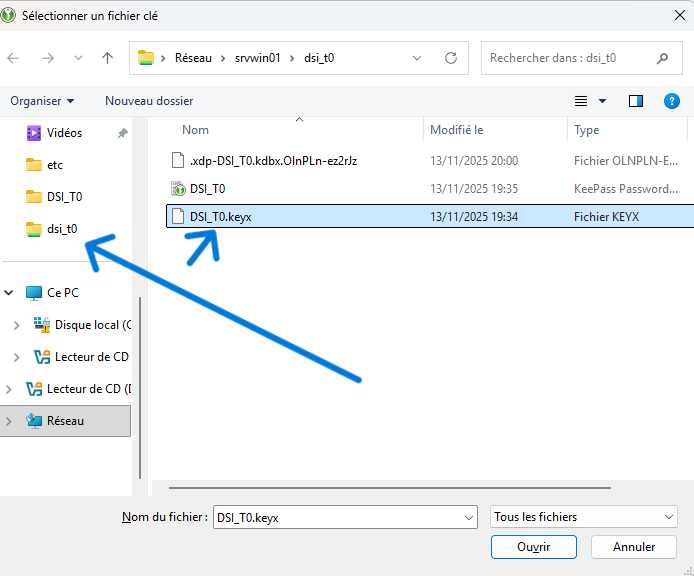


_Figure 4 : Explorateur Windows avec le fichier clé DSI_T0.keyx_

**À cette étape :**

1. Naviguez vers le dossier contenant votre fichier clé (souvent le même que la base)
2. Sélectionnez le fichier avec l'extension `.key` ou `.keyx`
    - Dans l'exemple : `DSI_T0.keyx` (Type : Fichier KEYX)
    - Modifié le : 13/11/2025 19:34
3. Vérifiez que le filtre affiche **Tous les fichiers** ou le type approprié
4. Cliquez sur **Ouvrir**

> ** Important** : Le fichier clé doit être EXACTEMENT celui utilisé lors de la création de la base. Une différence d'un seul octet rendra la base inaccessible.

---

### Étape 5 : Authentification (saisie du mot de passe)

Après avoir sélectionné le fichier clé, vous devez entrer votre mot de passe principal pour déverrouiller la base de données.

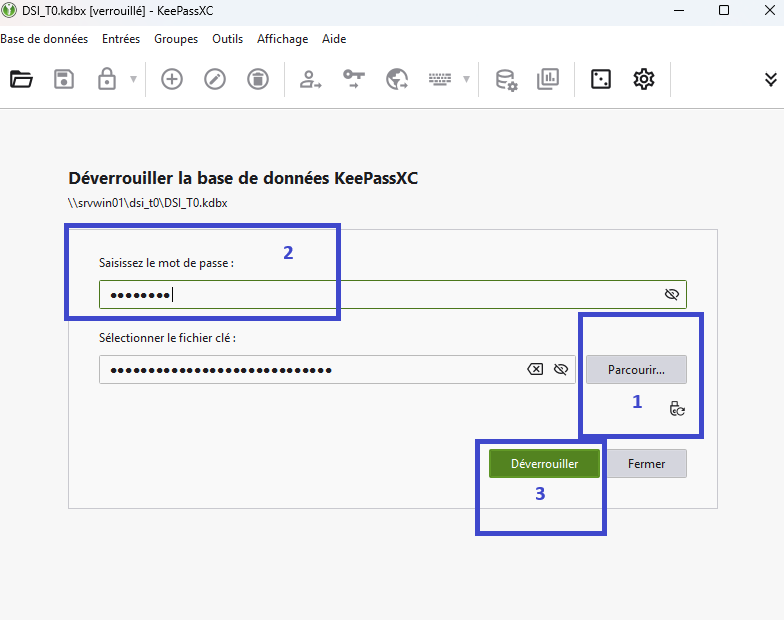


_Figure 5 : Fenêtre de déverrouillage avec double authentification_

**Procédure d'authentification complète :**

**Sélectionner le fichier clé** (partie inférieure)

- Le champ **Sélectionner le fichier clé :** affiche le chemin du fichier (masqué pour la sécurité)
- Si nécessaire, cliquez sur **Parcourir...** pour changer le fichier clé

**Saisir le mot de passe** (partie supérieure)

- Entrez votre mot de passe principal dans le champ **Saisissez le mot de passe :**
- Le mot de passe est masqué par des points noirs pour la sécurité
- Cliquez sur l'icône 👁️ pour afficher temporairement le mot de passe (si nécessaire)

**Déverrouiller** (bouton en bas à droite)

- Cliquez sur le bouton vert **Déverrouiller** pour ouvrir votre base
- Ou appuyez sur `Entrée` après avoir saisi le mot de passe

**Ordre des étapes :** L'ordre recommandé est : ① Fichier clé → ② Mot de passe → ③ Déverrouiller

> ** Sécurité renforcée** : La combinaison mot de passe + fichier clé offre une protection maximale. Sans ces DEUX éléments, vos données restent inaccessibles, même en cas de vol de votre ordinateur.

---

### Étape 6 : Accès à votre base de données

Une fois l'authentification réussie, vous accédez à l'interface principale de KeePassXC avec toutes vos entrées sécurisées.

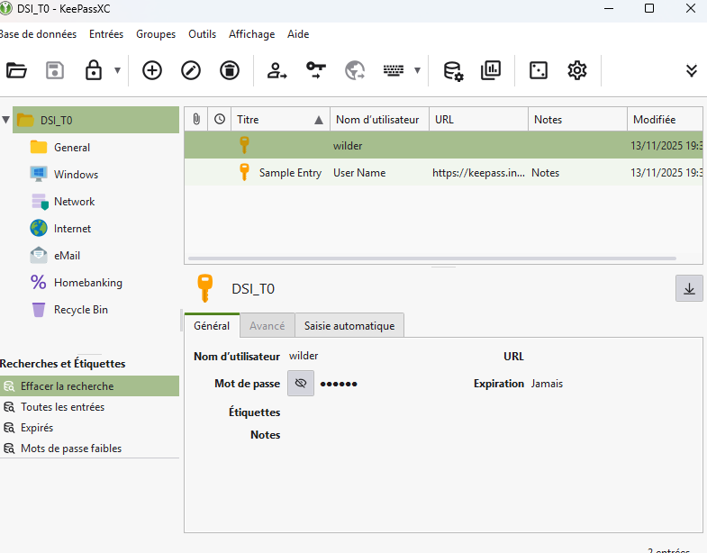


_Figure 6 : Interface principale avec la base de données DSI_T0 déverrouillée_


---


# Guide d'utilisation de KeePassXC sous Ubuntu
<span id="Ouverturebdd-ubuntu"></span>
## Prérequis

Ce guide suppose que KeePassXC est déjà installé et configuré sur votre système Ubuntu.

---

## Ouverture de votre base de données

### Étape 1 : Lancer l'application

Démarrez KeePassXC depuis votre menu d'applications Ubuntu ou via la ligne de commande :

```bash
keepassxc
```

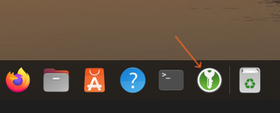


Figure 1 : Icône KeePassXC dans le dock Ubuntu (icône verte avec une clé)

---

### Étape 2 : Ouvrir une base de données existante

Dans la fenêtre principale de KeePassXC, cliquez sur le menu **Base de données** puis sélectionnez **Ouvrir une base de données**

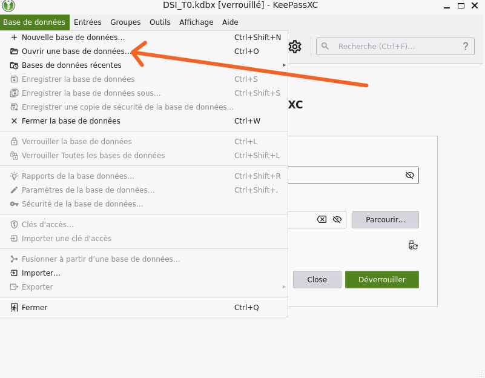


Figure 2 : Menu "Base de données" avec l'option "Ouvrir une base de données" (Ctrl+O)

**Méthodes alternatives :**

- Raccourci clavier : `Ctrl + O`
- Menu : **Base de données → Ouvrir une base de données**

---

### Étape 3 : Sélectionner votre base de données

Dans la boîte de dialogue qui s'ouvre, naviguez dans vos dossiers pour localiser votre fichier de base de données (extension `.kdbx`).


Figure 3 : Fenêtre de sélection avec le fichier DSI_T0.kdbx à choisir

**Points importants :**

- Les bases de données KeePassXC ont l'extension `.kdbx`
- Dans l'exemple : le fichier `DSI_T0.kdbx` (2,2 Ko) est identifié comme "KeePass 2 database"
- Sélectionnez votre fichier puis cliquez sur **Choisir** ou **Ouvrir**

---

### Étape 4 : Sélectionner le fichier clé (double authentification)

Si votre base de données utilise la double authentification, vous devrez d'abord sélectionner votre fichier clé.

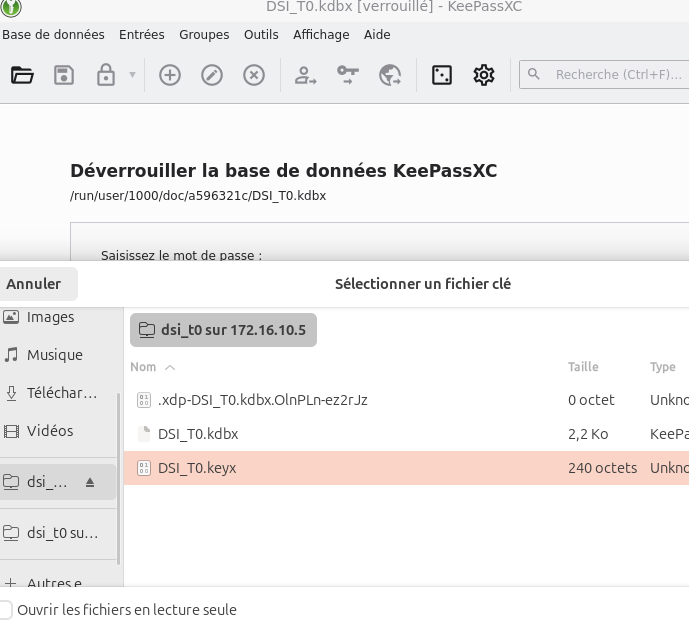


Figure 4 : Fenêtre de sélection du fichier clé (DSI_T0.keyx dans cet exemple)

**À cette étape :**

- Vous voyez le fichier `.keyx` ou `.key` dans votre dossier
- Dans l'exemple : `DSI_T0.keyx` (240 octets)
- Sélectionnez votre fichier clé puis cliquez sur **"Choisir"**

---

### Étape 5 : Authentification (saisie du mot de passe)

Après avoir sélectionné le fichier clé, vous devez entrer votre mot de passe principal pour déverrouiller la base de données.

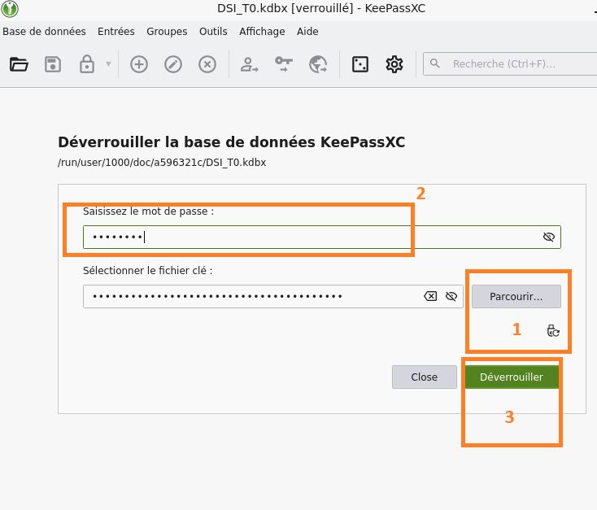


Figure 5 : Fenêtre de déverrouillage avec les trois éléments requis

**Procédure d'authentification :**

1. **Sélectionner le fichier clé** : Cliquez sur le bouton **Parcourir...** pour choisir votre fichier `.key` ou `.keyx`
    
    - Le chemin du fichier clé apparaît dans le champ (masqué par des points pour la sécurité)
2. **Saisir le mot de passe** : Entrez votre mot de passe principal dans le champ **Saisissez le mot de passe :**
    
    - Le mot de passe est masqué pour la sécurité
    - Attention aux majuscules/minuscules
3. **Déverrouiller** : Cliquez sur le bouton vert **Déverrouiller** pour ouvrir votre base
    

> **Note de sécurité** : La double authentification (mot de passe + fichier clé) renforce considérablement la sécurité de votre base de données. Sans ces DEUX éléments, impossible d'accéder à vos données. Conservez votre fichier clé dans un emplacement sécurisé et distinct de votre base de données.

---

### Étape 6 : Accès à votre base de données

Une fois authentifié avec succès, vous accédez à l'interface principale de KeePassXC avec toutes vos entrées.

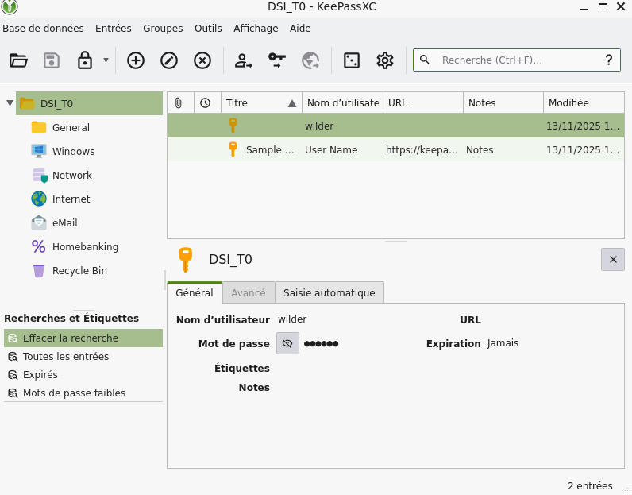


Figure 6 : Interface principale avec la base de données déverrouillée


# 3. FAQ
<span id="faq"></span>

## Questions fréquentes

### Comment débloquer ma base de données si j'ai oublié mon mot de passe maître ?

Malheureusement, il n'existe aucun moyen de récupérer ou réinitialiser un mot de passe maître oublié. KeePassXC utilise un chiffrement fort qui rend impossible l'accès à votre base de données sans le mot de passe correct. 

**Solutions préventives :**
- Conservez une copie de votre mot de passe maître dans un lieu sûr (coffre-fort physique)
- Créez des sauvegardes régulières de votre base de données
- Utilisez un fichier clé en complément du mot de passe pour faciliter la mémorisation

### Pourquoi KeePassXC ne se lance pas au démarrage de Windows 11 ?

Si KeePassXC ne démarre pas automatiquement, vérifiez les paramètres de démarrage automatique :

1. Ouvrez KeePassXC
2. Allez dans **Outils > Paramètres > Général**
3. Cochez l'option **Lancer KeePassXC au démarrage du système**

Si le problème persiste, vérifiez également dans le Gestionnaire des tâches de Windows (Ctrl+Shift+Esc) sous l'onglet **Démarrage** que KeePassXC est bien activé.

### Comment configurer le remplissage automatique dans mon navigateur sous Ubuntu ?

Pour utiliser le remplissage automatique des identifiants dans votre navigateur :

1. Installez l'extension de navigateur **KeePassXC-Browser** (disponible pour Firefox, Chrome, Brave, Edge)
2. Dans KeePassXC, allez dans **Outils > Paramètres > Intégration navigateur**
3. Cochez **Activer l'intégration KeePassXC pour le navigateur**
4. Sélectionnez votre navigateur dans la liste
5. Cliquez sur **Connecter** dans l'extension du navigateur

Une fois configuré, KeePassXC détectera automatiquement les formulaires de connexion et proposera de remplir vos identifiants.
